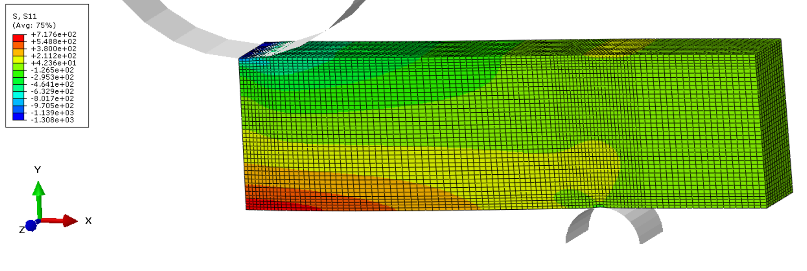

# Three-point bending test example

Provided Abaqus input file contains the example of three-point bending test. Lower support is fixed, upper support is force driven. Symetric boundary contitions are prescribed in Y-X and Y-Z planes.
 

